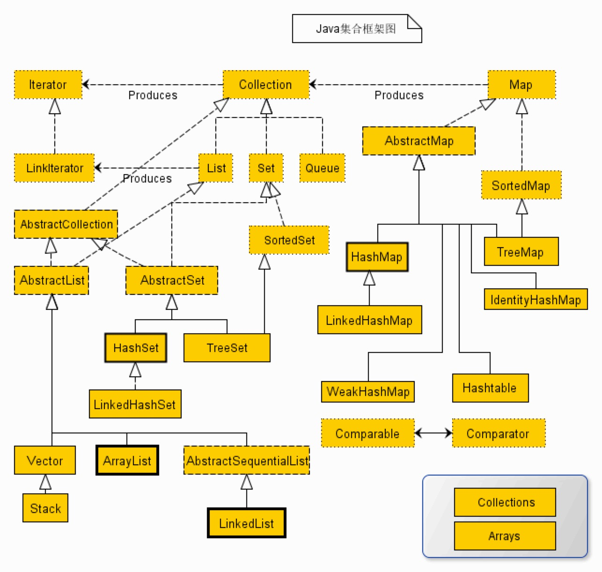
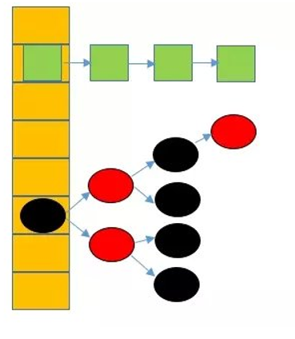

# Java集合（Collection）

先来看看一张整体的类图

类图中，实线边框是实现类，虚线边框是抽象类，点线边框是接口。

各位前外不要被上面这么复杂的类图给吓到，其实集合相对来说不难。

集合大体上可以分为以下四种

* List
* Set
* Map
* Queue

通常，一般情况下，我们关注前三种集合较多。在多线程与并发内容里，使用队列会多一些。这里，我们暂且关注前三种集合类型。

## List

从图中可以看出List是一个接口，继承了Collection接口。抽象类AbstractList实现了List接口。抽象类AbstractList的实现类有Vector、Stack、ArrayList、LinkedList(注意图中还有一层抽象类)。

Vector，又名向量，是线程安全的。查看Vector的源码，可知，内部使用synchronized关键字形容方法，依此实现线程安全。性能较低，目前已不推荐使用了。下面一段英文摘自，Vector类源码声明：

~~~
Unlike the new collection implementations,
Vector is synchronized.
If a thread-safe implementation is not needed,
it is recommended to use ArrayList in place of Vector.
~~~

Stack，栈。继承自Vector，栈是一种后进先出的数据结构。

ArrayList，可改变大小的List接口实现。这个应该是大家最熟悉的了，特点可以存储重复的元素，无序。如果要对一个ArrayList排序的话，可以调用sort方法，同时自己实现Comparator接口，自定义排序。它是一个数组的空间存储，获取元素可以直接通过下标获取。

LinkedList，一个采用链表存储的List，增加和删除操作快。

### 面试题

假设一个ArrayList里，含有如下元素：1,2,3,3,5,6,7,8,9,10。请实现一个方法删除能够被3整除的元素，for循环可以达到目的吗？Iterator呢？

考点：1. 在foreach语句中有两个限制，第一不能修改枚举成员，其次不要对集合进行删除操作；2. 使用for循环时，删除符合目的的元素后，元素会前移，需要重新判断；3. 可以使用Iterator的remove方法移除。

示例代码：

~~~
public class ArrayListDeleteElement {

  public static void main(String[] args) {

    List<Integer> numbers = new ArrayList<>();
    // 构造ArrayList元素：1,2,3,3,5,6,7,8,9,10
    for (int i = 0; i < 10; i++) {
      if (i == 3) {
        numbers.add(i);
      } else{
        numbers.add(i + 1);
      }
    }

//    for (int i = 0; i < numbers.size(); i++) {
//      if (numbers.get(i) % 3 == 0) {
//        numbers.remove(numbers.get(i));
//        i--; // 如果没有i--，请问会发生什么情况？因为元素前移，导致紧跟着的符合要求元素无法删除，所以，在移除后，应该执行i--操作
//      }
//    }

    // 会发生java.util.ConcurrentModificationException
    // 在foreach语句中有两个限制，第一不能修改枚举成员，其次不要对集合进行删除操作
//    for (Integer j : numbers) {
//      if (j.intValue() % 3 == 0) {
//        numbers.remove(j);
//      }
//    }

    // 使用Iterator默认的移除方式，是不会出问题的
    Iterator<Integer> iterable = numbers.iterator();
    while (iterable.hasNext()) {
      if (iterable.next().intValue() % 3 == 0) {
        iterable.remove();
      }
    }

    for (int i = 0; i < numbers.size(); i++) {
      System.out.print(numbers.get(i) + " ");
    }
    System.out.println();
  }
}
~~~

## Set：元素不可重复

SortedSet接口、AbstractSet抽象类实现Set接口，HashSet、TreeSet继承自AbstractSet，同时TreeSet实现了SortedSet接口。LinkedHashSet继承自HashSet。

HashSet：无序、元素不可重复。

LinkedHashSet：有序，根据插入顺序排序，元素不可重复。

TreeSet：有序，可以实现Comparator接口自定义排序方式。

### 面试题

对一个数组去重、并保持原有顺序。

考点：Set集合的特性，同时还要注意有序。

## Map

Map存储的是键值对，Key-Value模型。

图中的结构就不分析了，大家看图可以直接明白。

HashMap：无序的。注意，HashMap的数据结构是数据+链表的结构。

如上图所示，是HashMap的底层结构。注意，当链表长度大于8时，就会转换为红黑树，这是JDK1.8新增的。

LinkedHashMap：有序的，可以按插入排序，也可以按照最后访问顺序排序。

TreeMap：有序的，可实现Comparator接口实现排序。

HashTable：线程安全的，内部方法实现上使用了synchronized关键字。已不推荐使用，效率太低。

WeakHashMap：WeakHashMap实现了Map接口，是HashMap的一种实现，他使用弱引用作为内部数据的存储方案，WeakHashMap可以作为简单缓存表的解决方案，当系统内存不够的时候，垃圾收集器会自动的清除没有在其他任何地方被引用的键值对。如果需要用一张很大的HashMap作为缓存表，那么可以考虑使用WeakHashMap，当键值不存在的时候添加到表中，存在即取出其值。

IdentityHashMap：区别与其他的键不能重复的容器，IdentityHashMap允许key值重复，但是——key必须是两个不同的对象，即对于k1和k2，当k1==k2时，IdentityHashMap认为两个key相等，而HashMap只有在k1.equals(k2) == true 时才会认为两个key相等。

~~~
public static void main(String[] args) {
  Map<String,String> map =new IdentityHashMap<String,String>(100);//初始化容器的大小
  String a="aa";
  String b=new String("aa");
  System.out.println(a==b); // false

  map.put(a, "cc");
  map.put(b, "bb");
  map.put("2", "dd");
  System.out.println(map.size());//3
}
~~~

### 面试

这里后两个Map了解即可，面试几乎不会涉及。面试时，很大可能性会引出ConcurrentHashMap这个数据结构。目前，在这里暂时不分析，后续记录多线程并发的内容时来形容这个数据结构。
